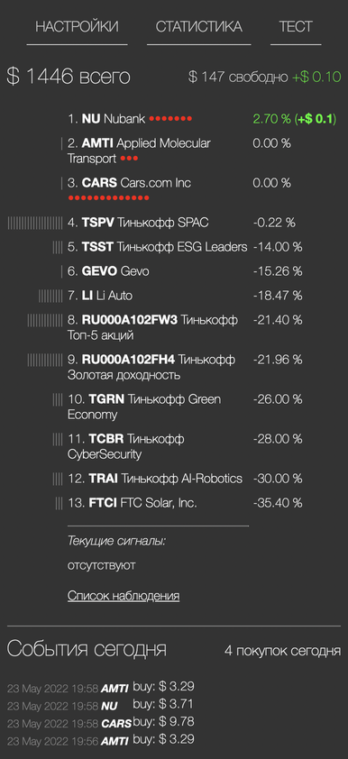
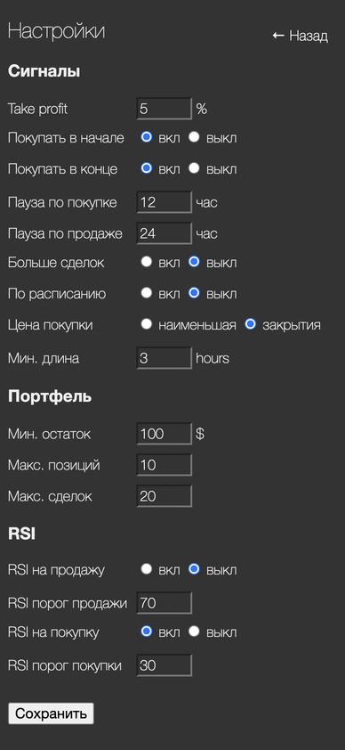
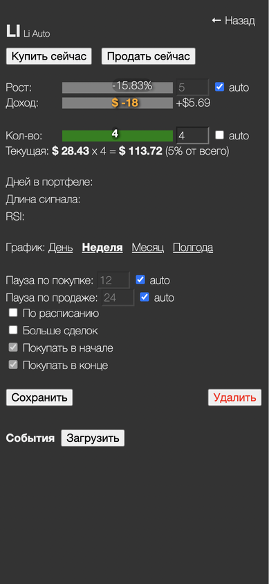
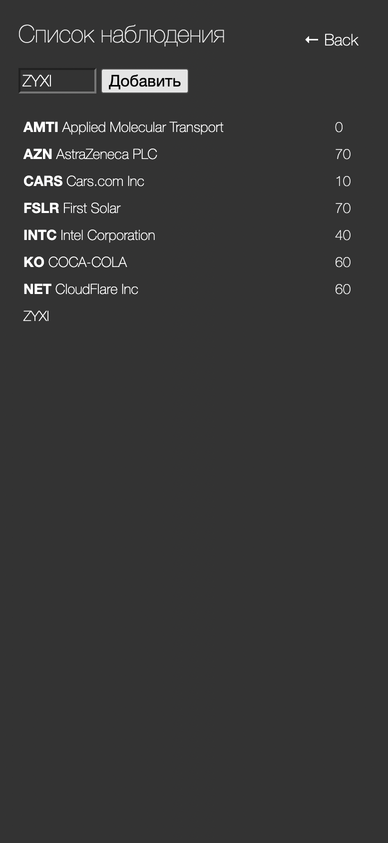
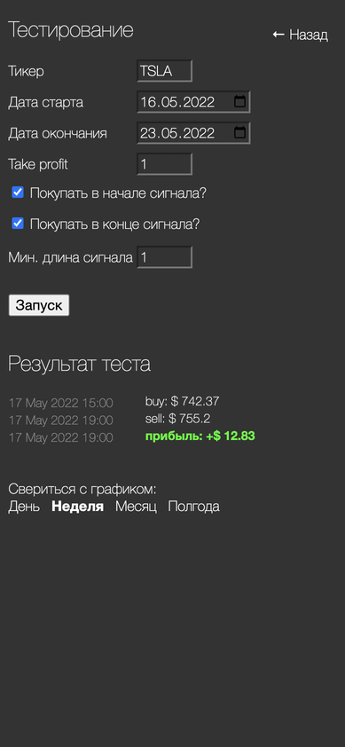
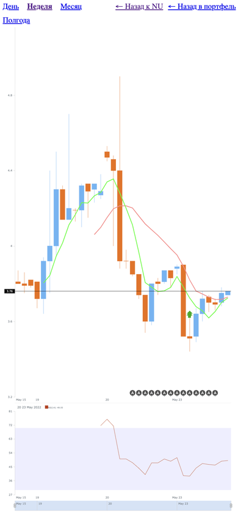
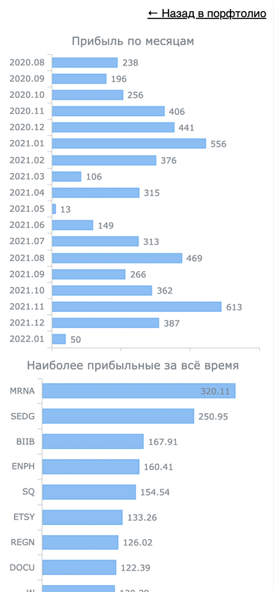

# Введение

Приветствую, коллеги!
Представляю вашему вниманию переработанную версию робота, которым я пользовался (точнее, непрерывно допиливал :))  с 2020 по 2021 год.

Специально для конкурса был сделан порт с API v1 на v2, добавлены страницы со статистикой и тестированием на исторических данных, а также произведена общая полировка интерфейса.

## Демо-версия

Ознакомиться с решением вживую можно по адресу:
http://92.255.78.150:7777/ui (десктопный+мобильный)
Там подключен read-only токен.

## Интерфейс

- портфель
- настройки
- инструмент
- список отслеживания
- тестирование
- графики инструмента
дневной, недельный, месячный и полугодовой
- статистика










## Запуск

Перед запуском нужно создать свой **.env**-файл на основе **.env.example**.
Все параметры прокомментированы внутри.

Требуется **node v14 и выше**. Для конкурса проект разрабатывался на node v16.13.2.
Также используется БД **postgresql v12.3**. На других версиях не тестировалось. Если в системе установлены docker и docker-compose, то БД можно поднять командой ```docker-compose up -d db```.
Сам сервер запускается командой ```npm start```.

## Описание торгового алгоритма

В основе алгоритма лежит пересечение двух скользящих средних, быстрой и медленной, на часовых интервалах.
По ним робот определяет момент просадки инстумента, что и служит сигналом для покупки.
А сигналом для продажи, в свою очередь, служит достижение указанного значения take profit.
Дополнительно можно включить проверку по RSI.
Подробнее см. раздел "Настройки робота".

## Тестирование без вывода ордеров на реальную биржу

Для тестирования имеется параметр DRY_RUN в .env, который блокирует выставление заявок. В остальном тестирование максимально приближено к реальности.

## Ведение статистики работы алгоритма

Изначально для отображения графиков статистики использовалось решение от Zoho Analytics (бесплатное). 
Но по условиям конкурса добавлена своя встроенная статистика.
В рамках неё отображены два основных показателя эффективности алгоритма: доходность по месяцам и доходность по инструментам.
Также отображаются события (покупки и продажи) текущего дня на главной странице.

## Тестирование стратегии на исторических данных

В связи с тем, что доступный в API период для часового таймфрейма не превышает неделю, тестирование ограничивается одним событием покупки-продажи. Этого достаточно, чтобы убедиться в работоспособности стратегии и перебрать ключевые параметры для большей эффективности.

# Настройки робота

## На уровне сервера (env):

DAYS - на сколько дней назад проверять историю цены
SLOW - период медленной MA
FAST - период быстрой MA

## На уровне интерфейса:

# Take profit
При какой доходности открывать заявку на продажу

# Покупать в начале/конце
В какой момент падения создавать заявку

# Пауза по покупке/продаже
Сколько часов выждать до следующей заявки по этому инструменту

# Больше сделок
Большая чувствительность MA

# По расписанию
Принудительная покупка независимо от сигнала

# Цена покупки 
На какое значение свечи ориентироваться

# Мин. длина
Сколько часов должно длиться падение, прежде чем создать заявку

# Мин. остаток
При каком уровне кэша прекратить покупки

# Макс. позиций 
При какой заполненности портфеля прекратить покупки

# Макс. сделок
После какого количества покупок в день прекратить покупки

# RSI на продажу/покупку и RSI порог
Дополнительная проверка по RSI
